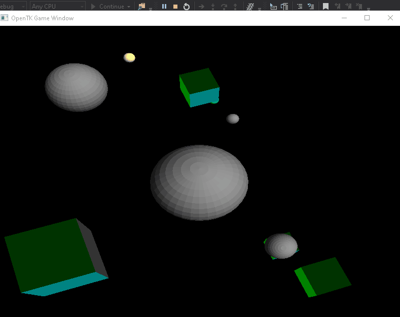
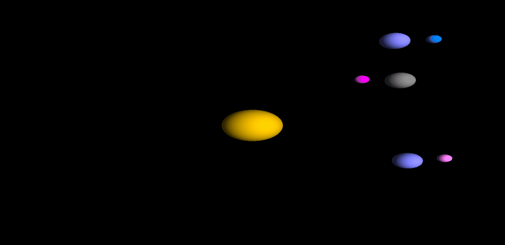

# OpenTKTut
- [use this invite link to see code in my private repo](https://github.com/HMS-ELKHOLY/OpenTKTut_/invitations)
- [you need solarsystem branch in the private repo](https://github.com/HMS-ELKHOLY/OpenTKTut_/tree/SolarSystem)

## changes :

- add normal vectors for cubes 
- view color material
- added abilty to change spheres' color  
-  added abilty to change spheres' center of rotation
-  added abilty to change   angle of roation for axis specified by remote center
-  added abilty to change   velocity  of roation around remote center
- construct Solar System 
- smoothing spheres
**here is an example**

23 days ago
 

12/19/2019
 

## need to do 
- texture mapping
- add space rocket to explore the solar system
- use keyboard to control space rocket
